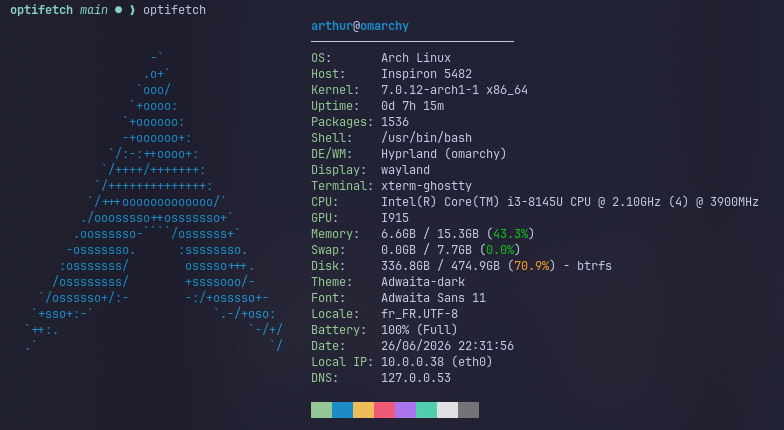

# Optifetch

Un outil d'information système rapide, léger, écrit en C et sans dépendances externes. Inspiré de Fastfetch, il se concentre sur la rapidité d'exécution et la personnalisation via un fichier de configuration simple.

<p align="center">
  
</p>

## Fonctionnalités

- **Zéro dépendance** : Uniquement la bibliothèque C standard (glibc/musl).
- **Ultra-rapide** : Aucun appel système lourd, lecture directe de `/proc` et `/sys`.
- **Hautement personnalisable** : Fichier de configuration texte avec variables et balises.
- **Logos dynamiques** : Place tes logos ASCII dans `logos/nom_os.txt`.
- **Alignement automatique** : Système de balises `{align:id}` pour un rendu parfait.
- **Couleurs True Color (RGB)** : Support de `{fg:R,G,B}` et `{distro_color}`.

## Compilation

Assure-toi d'avoir `gcc` et `make` d'installés, puis exécute :

```bash
chmod +x build.sh
./build.sh
```

Ou manuellement :

```bash
make
```

## Installation système

Pour installer optifetch et ses logos globalement :

```bash
sudo make install
```

## Configuration

Au premier lancement, un fichier de configuration est généré dans `~/.config/optifetch.conf`.
Tu peux l'éditer pour modifier l'affichage.

Pour obtenir la liste de toutes les variables et balises disponibles :

```bash
optifetch help
```

## Logos

Les logos sont stockés dans des fichiers `.txt` situés dans :

1. `./logos/` (dossier local)
2. `/usr/share/optifetch/logos/` (dossier système)

Le nom du fichier doit correspondre à l'ID de l'OS (ex: `arch.txt`, `debian.txt`).
